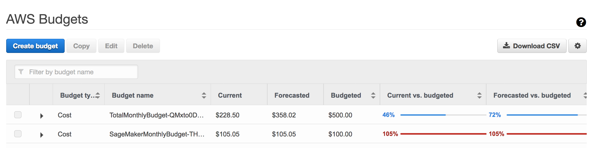
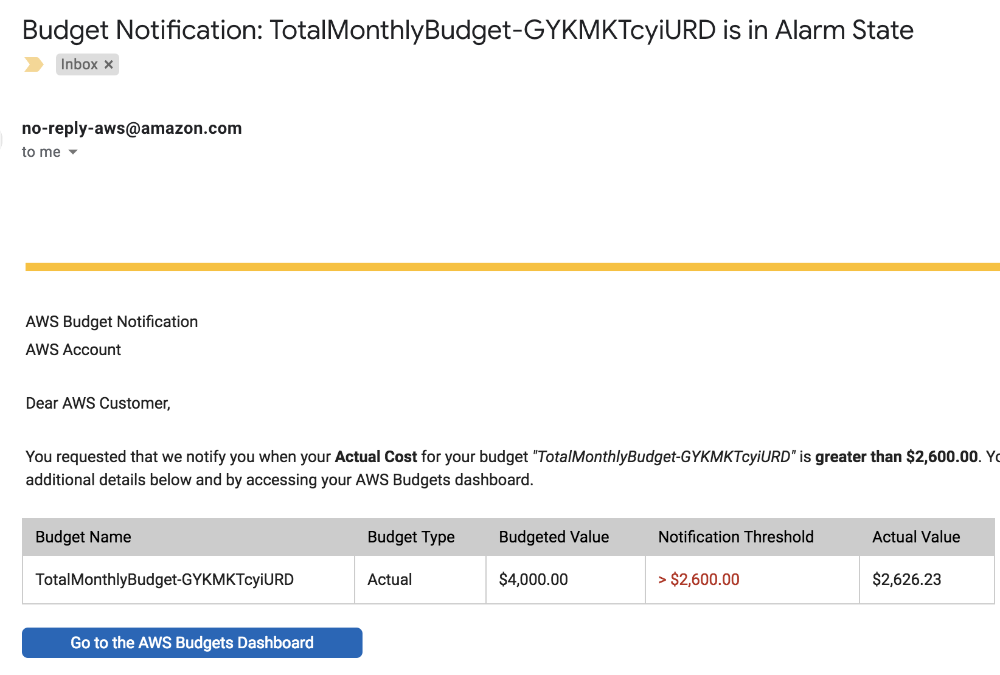
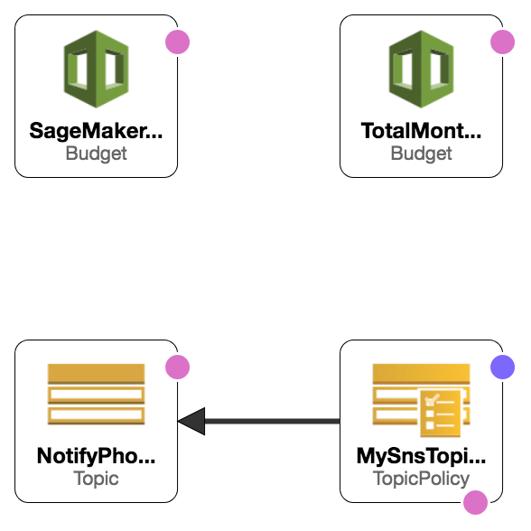

# AWS Budget Notifications
## Introduction

AWS Budgets gives you the ability to set custom budgets that alert you when your costs or usage exceed (or are forecasted to exceed) your budgeted amount. In May 2018, AWS has provided the capability to automate the provisioning of AWS Budget capabilities using the [AWS::Budgets::Budget](https://docs.aws.amazon.com/AWSCloudFormation/latest/UserGuide/aws-resource-budgets-budget.html) CloudFormation resource.

With this, you get a visualization of your various budgets from the AWS Budgets console. This includes the you actuals versus your budget and your projected AWS spend for the given period (e.g. monthly, quarterly, and annually). What’s more, you can configure AWS Budgets to send you notifications via Amazon SNS via text or email based on thresholds that you can configure.

In this blog post, you’ll learn how to codify your AWS Budgets configuration for your AWS accounts at a specific interval while receiving alert notifications based on predefined thresholds to multiple emails and SMS endpoints. Moreover, you’ll be able to see a visualization of your actuals versus your budgets at any time.

You can manually create a budget. As an exercise, go through the steps defined at [AWS Budgets](https://aws.amazon.com/aws-cost-management/aws-budgets/). The results will look similar to figure below. 



You can also configure Budgets to send email notifications to SNS topics as shown in the figure below. 



Once you've manually configured this, you'll want to be able to define it consistently and update in code. To do this, you use AWS CloudFormation.

Here's an example of the code snippet that defines the AWS Budget resource in CloudFormation. The remainder of this post shows you how to launch an example CloudFormation stack to send budget notifications and to modify the configuration using CloudFormation. 

```  TotalMonthlyBudget:
    Type: "AWS::Budgets::Budget"
    Properties:
      Budget:
        BudgetLimit:
          Amount: !Sub ${BudgetLimit}
          Unit: !Sub ${Currency}
        TimeUnit: MONTHLY
        TimePeriod:
          Start: !Sub ${StartTime}
          End: !Sub ${EndTime}
        BudgetType: COST
      NotificationsWithSubscribers:
        - Notification:
            NotificationType: ACTUAL
            ComparisonOperator: GREATER_THAN
            Threshold: !Sub ${Threshold02}
          Subscribers:
          - SubscriptionType: EMAIL
            Address: !Sub ${EMail01}
          - SubscriptionType: SNS
            Address: !Sub ${NotifyPhonesSNS}
        - Notification:
            NotificationType: ACTUAL
            ComparisonOperator: GREATER_THAN
            Threshold: !Sub ${Threshold01}
          Subscribers:
          - SubscriptionType: EMAIL
            Address: !Sub ${EMail01}
          - SubscriptionType: SNS
            Address: !Sub ${NotifyPhonesSNS}
```

## Prerequisites
- **AWS account** – Follow these instructions to create an AWS Account: [Create an AWS Account](http://docs.aws.amazon.com/AmazonSimpleDB/latest/DeveloperGuide/AboutAWSAccounts.html)

## Architecture and Implementation
###  Architecture Diagram


## CloudFormation Templates resources
  - **AWS Budget** – [AWS::Budgets::Budget](https://docs.aws.amazon.com/AWSCloudFormation/latest/UserGuide/aws-resource-budgets-budget.html) – 
Creates, replaces, or deletes budgets for Billing and Cost Management..
  - **AWS SNS Topic** – [AWS::SNS::Topic](https://docs.aws.amazon.com/AWSCloudFormation/latest/UserGuide/aws-properties-sns-topic.html) – sends a confirmation to the email specified as a parameter.
  - **AWS SNS Topic Policy** – [AWS::SNS::TopicPolicy](https://docs.aws.amazon.com/AWSCloudFormation/latest/UserGuide/aws-properties-sns-policy.html) – The AWS::SNS::TopicPolicy resource associates Amazon SNS topics with a policy..

## Costs
This section outlines cost considerations for provisioning AWS Budgets Notifications. 
- **CloudFormation** – No Additional Cost
- **Budgets** – "AWS Budgets lets you set custom cost and usage budgets that alert you when your budget thresholds are exceeded. Your first two budgets are free, and each subsequent budget will incur a $.02 daily cost.”
More can be found at [AWS Cost Management Pricing](https://aws.amazon.com/aws-cost-management/pricing/). 
- **SNS** – Realistically no cost – Free for first 1 million SNS requests and for first 1,000 Email Deliveries each month.

## Deployment Steps
####  Step 1. Prepare an AWS Account
Create your AWS account at [http://aws.amazon.com](http://aws.amazon.com) by following the instructions on the site.

####  Step 2. Launch the Stack
Click on the **Launch Stack** button below to launch the CloudFormation Stack to set up your AWS Budgets. 

**Stack Assumptions:** The pipeline stack assumes the following conditions, and may not function properly if they are not met:
1. The pipeline stack name is less than 20 characters long
2. The stack is launched in the US East (N. Virginia) Region (`us-east-1`).

*NOTE: The URL for Launch Stack is automatically generated through a pipeline in one of Stelligent's AWS accounts.*

[](https://console.aws.amazon.com/cloudformation/home?region=us-east-1#cstack=sn~sagemaker-stack|turl~https://s3.amazonaws.com/sagemaker-pipeline-src/CodePipeline/pipeline.yaml)

You can launch the same stack using the AWS CLI. Here's an example:

`aws cloudformation create-stack --stack-name YOURSTACKNAME --template-body file:///home/ec2-user/environment/tools/budget-notifications.yml --parameters ParameterKey=EMail01,ParameterValue=YOUREMAIL@example.com ParameterKey=PhoneNumber01,ParameterValue=12125551212 ParameterKey=BudgetLimit,ParameterValue=1000 ParameterKey=Threshold01,ParameterValue=65 --capabilities CAPABILITY_NAMED_IAM`

## Parameters
Parameters | Description
---------- | -----------
Currency | Country currency. Default is `USD`.
StartTime | Start Time for the first day in which AWS Budgets is reporting on cost usage.
EndTime | End Time for the last day in which AWS Budgets is reporting on cost usage.
BudgetLimit | Numeric form of budget limit for the evaluated time period. Default is: `1000`. 
SageMakerBudgetLimit | Numeric form of budget limit for a specifc service (`Amazon SageMaker` in this case) for the evaluated time period.
Threshold01 | Number between 0 and 100 representing the percentage of the `BudgetLimit` in which people get notified
Threshold02 | Number between 0 and 100 representing the next percentage of the `BudgetLimit` in which people get notified
EMail01 | Email address for which budget notifications are sent. Example is `example@example.com`.
PhoneNumber01 | Phone number for which budget notifications are sent via SMS. Format is `12125551212`. Number must be preceded by the country code (e.g. USA is `1`)

####  Step 3. Test the Deployment
Go to the [AWS Budgets dashboard](https://console.aws.amazon.com/billing/home?#/budgets) and verify the budgets have been created correctly.

#  Filtering Budgets 
You can filter your budgets by all types of criteria. The most effective way I found to automate this was to edit an existing budget to get the data. There's probably a way to do it through the API but it wasn't obvious to me. 


## Filtering by Service

Go back to the [AWS Budgets dashboard](https://console.aws.amazon.com/billing/home?#/budgets) and *select the checkbox* next to the budget you'd like to modify and click **Edit**. For example, to filter on a specific service, select the **Service** checkbox in the *Refine your budget* section. Choose the Service or Services you'd like to filter. For example, if you want to filter on `Amazon SageMaker`, choose this from the Service selection. Once you've done, save the budget. To automate it in CloudFormation, you'll need to run the following command from the command line and put the relevant results in your CloudFormation template. 


`aws budgets describe-budgets --account-id <ACCOUNTID>`

The results look like this: 

```
            "CostFilters": {
                "Service": [
                    "Amazon SageMaker"
                ]
            }
```

And this translates to the following in CloudFormation YAML. `CostFilters` is a Property of `AWS::Budgets::Budget`:
```
        CostFilters:
          Service:
          - Amazon SageMaker
```


##  Filtering by Linked Accounts

You can go through the same process for filtering on AWS accounts. 

The results returned when running `aws budgets describe-budgets --account-id <ACCOUNTID>` look like this (Your account ids should be something other than `123456789012`:


```
            "CostFilters": {
                "LinkedAccount": [
                    "123456789012", 
                    "123456789012"
                ]
            }
```

The account id values can be defined in the comma-delimited parameter name: `LinkedAccountNumbers`.

# Additional Resources
* [AWS::Budgets::Budget](https://docs.aws.amazon.com/AWSCloudFormation/latest/UserGuide/aws-resource-budgets-budget.html)
* [AWS Budgets](https://aws.amazon.com/aws-cost-management/aws-budgets/)

## Summary
You learned how to use the AWS Budgets feature and automate its provisioning.