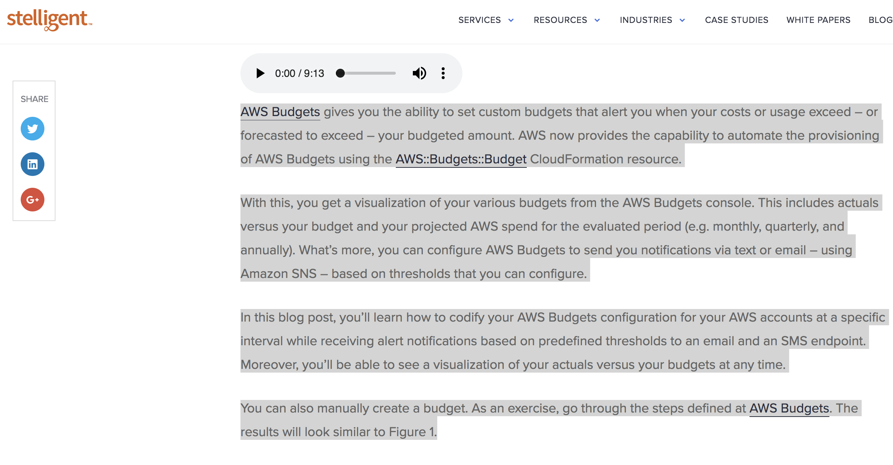
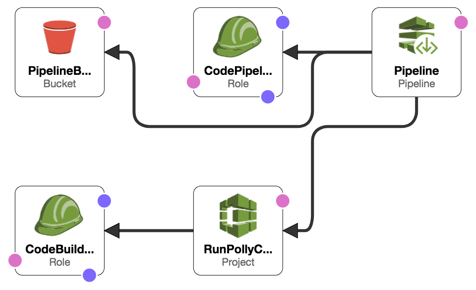
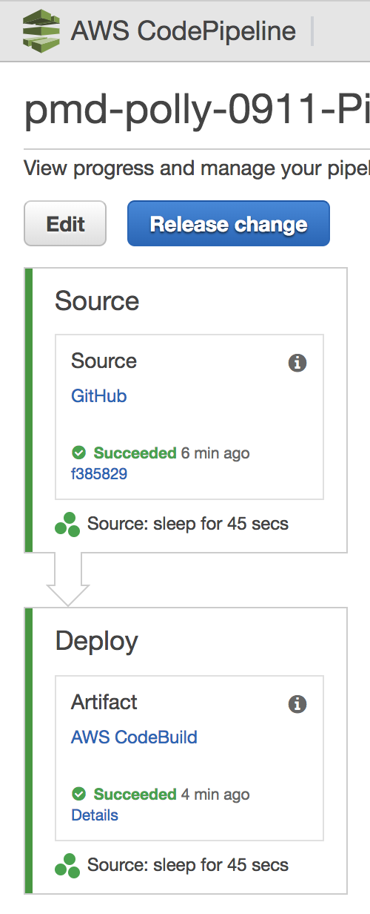

# AWS Polly
## Introduction

In our previous post on [automating AWS Budgets](https://stelligent.com/2018/08/22/aws-budget-notifications-in-cloudformation/), I included an embedded audio file that read each word of the blog post. I did this using an AWS service called [Amazon Polly](https://aws.amazon.com/polly/). I got this idea after noticing that [Jeff Barr](https://aws.amazon.com/developer/community/evangelists/jeff-barr/), Chief Evangelist at AWS, had started doing this for the AWS News blog. I really enjoy listening to books from my Audible collection so this was particularly intriguing to me.

To create an audio file of my last post, I created an Amazon S3 bucket, copied the text from my blog post and pasted it into the text field for Amazon Polly, configured Polly to create the audio file, and click a button. Once it was complete, I made the mp3 file publicread in S3, and copied the URL to the blog post in Wordpress.

Since there were some repetitive steps, I figured I would automate as many of them as I could because, well, I'm [lazy](http://wiki.c2.com/?LazinessImpatienceHubris) and don't like doing the same things over and over again. My other motiviation was that I would like to see more of the blogs I visit to include this kind of audio narration so that I and others can listen to them.

There are 5 steps you'll go through to publish a recording to your blog post or website. They are: 

1. Copy display text from website
1. Commit text file to GitHub
1. Launch CloudFormation Stack
1. Get URL from Deployment Pipeline
1. Manually Update HTML with Audio File

Each of these steps are described in the remainder of this blog post.

# Step 1 - Copy display text from website
Manual: Copy text from website



# Step 2 - Commit text file to GitHub
Commit to text file in github

```
git add blog.text
git commit -am "update blog text" && git push
```

# Step 3 - Launch CloudFormation Stack
CloudFormation of S3 bucket for storage, IAM Roles, Cloudwatch event notifications, Codebuild, Codepipeline, SNS

## Architecture and Implementation
###  Architecture Diagram


## CloudFormation Templates resources
  - [AWS::CodeBuild::Project](https://docs.aws.amazon.com/AWSCloudFormation/latest/UserGuide/aws-resource-codebuild-project.html)
  - [AWS::S3::Bucket](https://docs.aws.amazon.com/AWSCloudFormation/latest/UserGuide/aws-properties-s3-bucket.html)
  - [AWS::IAM::Role](https://docs.aws.amazon.com/AWSCloudFormation/latest/UserGuide/aws-resource-iam-role.html)
  - [AWS::CodePipeline::Pipeline](https://docs.aws.amazon.com/AWSCloudFormation/latest/UserGuide/aws-resource-codepipeline-pipeline.html)

## CodeBuild
```
  RunPollyCommands:
    Type: AWS::CodeBuild::Project
    DependsOn: CodeBuildRole
    Properties:
      Name: !Sub ${AWS::StackName}-PollyCommands
      Description: Deploy site to S3
      ServiceRole: !GetAtt CodeBuildRole.Arn
      Artifacts:
        Type: CODEPIPELINE
      Environment:
        Type: !Ref BuildType
        ComputeType: !Ref BuildComputeType
        Image: !Sub ${BuildImage}
      Source:
        Type: CODEPIPELINE
        BuildSpec: !Sub |
          version: 0.2
          phases:
            post_build:
              commands:
                - aws --version
                - testvar=$(cat ./labs/polly/blog.txt)
                - aws polly start-speech-synthesis-task --output-format mp3 --output-s3-bucket-name ${PollyRecordingsBucket} --text "$testvar" --voice-id Joanna 
                - pollyObjectId=$(aws polly list-speech-synthesis-tasks --max-results 1 --query 'SynthesisTasks[].TaskId' --output text)
                - pollyObjectTaskId=$(echo $pollyObjectId.mp3)
                - sleep 45
                - aws s3api put-object-acl --bucket ${PollyRecordingsBucket} --key "$pollyObjectTaskId" --acl public-read
          artifacts:
            files:
            - '**/*'
      TimeoutInMinutes: 10
```

## Costs
This section outlines cost considerations for provisioning AWS Budgets Notifications. 
- **CloudFormation** – No Additional Cost

## Deployment Steps
####  Step 1. Prepare an AWS Account
Create or login AWS account at [http://aws.amazon.com](http://aws.amazon.com) by following the instructions on the site.

####  Step 2. Launch the Stack
Click on the **Launch Stack** button below to launch the CloudFormation Stack to set up your AWS Budgets. 

**Stack Assumptions:** The pipeline stack assumes the following conditions, and may not function properly if they are not met:
1. The pipeline stack name is less than 20 characters long
2. The stack is launched in the US East (N. Virginia) Region (`us-east-1`).

*NOTE: The URL for Launch Stack is automatically generated through a pipeline in one of Stelligent's AWS accounts.*

[](https://console.aws.amazon.com/cloudformation/home?region=us-east-1#cstack=sn~sagemaker-stack|turl~https://s3.amazonaws.com/sagemaker-pipeline-src/CodePipeline/pipeline.yaml)

You can launch the same stack using the AWS CLI. Here's an example:

```
aws cloudformation create-stack --stack-name YOURSTACKNAME --template-body file:///home/ec2-user/environment/cloudformation_templates/labs/polly/pipeline.yml --parameters ParameterKey=GitHubToken,ParameterValue=GITHUBTOKEN --capabilities CAPABILITY_NAMED_IAM --no-disable-rollback
```

## Parameters
Parameters | Description
---------- | -----------
GitHubUser | Your unique GitHub userid. Default is `stelligent`
GitHubRepo | GitHub Repo to pull from. Only the Name. not the URL. Default is `cloudformation_templates`
GitHubBranch | GitHub Branch. Default is `master`
GitHubToken | Available at https://github.com/settings/tokens. Should have access to the [following](https://github.com/stelligent/devops-essentials/wiki/Prerequisites#create-an-oauth-token-in-github)
BuildType | The build container type to use for building the app. Default is `LINUX_CONTAINER`
BuildComputeType | The build compute type to use for building the app. Default is `BUILD_GENERAL1_SMALL`
BuildImage | The build image to use for building the app. Default is `aws/codebuild/ubuntu-base:14.04`

####  Step 3. Test the Deployment
Go to the [AWS Polly Synthesis Tasks](https://console.aws.amazon.com/polly/home/SynthesisTasks) and verify the audio recordings have been generated. There's an S3 URL column available to download the file as well.


# Additional Resources
* [Amazon Polly Plugin for WordPress Update – Translate and Vocalize Your Content](https://aws.amazon.com/blogs/aws/amazon-polly-plugin-for-wordpress-update-translate-and-vocalize-your-content/)
* [Amazon Polly Update – Time-Driven Prosody and Asynchronous Synthesis](https://aws.amazon.com/blogs/aws/amazon-polly-update-time-driven-prosody-and-asynchronous-synthesis/)

## Summary
You learned how to create an audio recording of blog post and embed a player so readers can listen to an audio rendition of your post. 

# Step 4 - Deployment Pipeline
Pipeline




* **Source**: Github
* **Build**: CodeBuild 

Copies file from Codepipeline input artifact to S3

Run Amazon Polly commands and store Output in S3

# Step 5 - Manually Update HTML

One Time: update Html with audio tag that points to location in S3. How to find the full URL for the mp3 file

```
<audio controls>
  <source src="https://s3.amazonaws.com/pmd-polly-1334-polly-files/blog.01c3a373-70e3-446f-8bf3-2da95d52c3e5.mp3" type="audio/mpeg">
  Your browser does not support the audio tag.
</audio>
```

# Tips
`pip install awscli --upgrade --user` (didn't have `start-speech-synthesis-task`)

Use the same file name in S3 so that it can be used as a URL (and make it public)

Add manual approvals for manual tasks such as copying text and updating HTML with the new S3 HTTP URL

Describe the `sleep 45` I added to the CodeBuild commands

How to find the full URL for the mp3 file

1. Manually create an Amazon S3 bucket
1. Manually create an Amazon Text-to-Speech MP3 and synthesize to Amazon S3
1. Make the MP3 public
1. Create an HTML audio tag snippet and embed in the blog post (HTML/Wordpress)
1. Create a custom CloudFormation resource
1. The Lambda in the custom CloudFormation resource will using the AWS CLI to create MP3 using Amazon Polly
1. Create a CloudFormation template that creates the S3 bucket, uses the Amazon Polly custom resource, and a CodePipeline that uses Polly every time some text is changed. 
1. @TODO Convert commands from `test.sh` to CodeBuild. Then use GitHub and have CodeBuild copy from GitHub to S3 and download it locally and use with Polly.

New Idea: Use CodeBuild to do the same thing using the AWS CLI?

Question: How to automatically upload text from Wordpress changes to S3 or a version control repo?

https://stelligent.com/feed/

https://stelligent.com/?s=TotalMonthlyBudget&feed=rss2

curl "https://stelligent.com/?s=TotalMonthlyBudget&feed=rss2"  2>/dev/null

curl "https://stelligent.com/?s=TotalMonthlyBudget"  2>/dev/null

https://docs.aws.amazon.com/cli/latest/reference/polly/synthesize-speech.html

wget https://s3.amazonaws.com/delete-pmd-guardduty/text-for-polly/text-for-polly.txt
https://docs.aws.amazon.com/polly/latest/dg/get-started-cli-exercise.html

testvar=$(cat text-for-polly.txt)
echo $testvar

aws polly start-speech-synthesis-task --output-format mp3 --voice-id Joanna --output-s3-bucket-name BUCKETNAME --text $testvar hello.mp3

Here's an example of the code snippet...